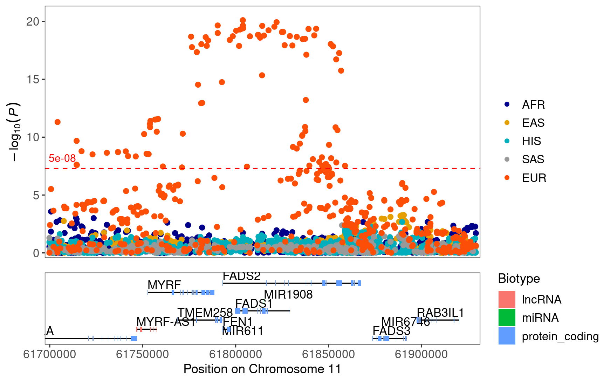

# FADS regionplot


``` r
library(readr)
library(topr)
```

``` r
region_files <- list.files(
    here::here(
        "data",
        "processed",
        "sumstats"
    ),
    pattern = "chr11_61000000_63000000",
    full.names = TRUE
)

names(region_files) <- c("AFR", "EAS", "HIS", "SAS", "EUR")
regions <- lapply(region_files, read_tsv)
```

    Rows: 8586 Columns: 8
    ── Column specification ────────────────────────────────────────────────────────
    Delimiter: "\t"
    chr (3): SNP, A1, A2
    dbl (5): CHR, BP, OR, SE, PVAL

    ℹ Use `spec()` to retrieve the full column specification for this data.
    ℹ Specify the column types or set `show_col_types = FALSE` to quiet this message.
    Rows: 3785 Columns: 8
    ── Column specification ────────────────────────────────────────────────────────
    Delimiter: "\t"
    chr (3): SNP, A1, A2
    dbl (5): CHR, BP, OR, SE, PVAL

    ℹ Use `spec()` to retrieve the full column specification for this data.
    ℹ Specify the column types or set `show_col_types = FALSE` to quiet this message.
    Rows: 7459 Columns: 8
    ── Column specification ────────────────────────────────────────────────────────
    Delimiter: "\t"
    chr (3): SNP, A1, A2
    dbl (5): CHR, BP, OR, SE, PVAL

    ℹ Use `spec()` to retrieve the full column specification for this data.
    ℹ Specify the column types or set `show_col_types = FALSE` to quiet this message.
    Rows: 2888 Columns: 8
    ── Column specification ────────────────────────────────────────────────────────
    Delimiter: "\t"
    chr (3): SNP, A1, A2
    dbl (5): CHR, BP, OR, SE, PVAL

    ℹ Use `spec()` to retrieve the full column specification for this data.
    ℹ Specify the column types or set `show_col_types = FALSE` to quiet this message.
    Rows: 3749 Columns: 8
    ── Column specification ────────────────────────────────────────────────────────
    Delimiter: "\t"
    chr (3): SNP, A1, A2
    dbl (5): CHR, BP, OR, SE, PVAL

    ℹ Use `spec()` to retrieve the full column specification for this data.
    ℹ Specify the column types or set `show_col_types = FALSE` to quiet this message.

``` r
regionplot(
    regions,
    legend_labels = names(regions),
    show_overview = FALSE,
    gene = "FADS1"
)
```

    [1] "Zoomed to region:  11:61699627-61929318"


